# One-Dimensional Quantum Systems

A Python project for computationally exploring fundamental models in one-dimensional quantum mechanics using analytical
solutions and numerical finite-difference methods.

## Current Contents

### Infinite Square Well

The infinite square well is studied using both analytical solutions and numerical finite-difference methods.

Current calculations include:

- Analytical wavefunctions for the first three energy eigenstates
- Probability densities for the first three energy eigenstates
- Energy levels for the first three states
- Numerical solution using the finite-difference method
- Comparison between numerical and analytical energy eigenvalues
- Calculations use natural units with $\hbar = m = L = 1$

#### Wavefunctions

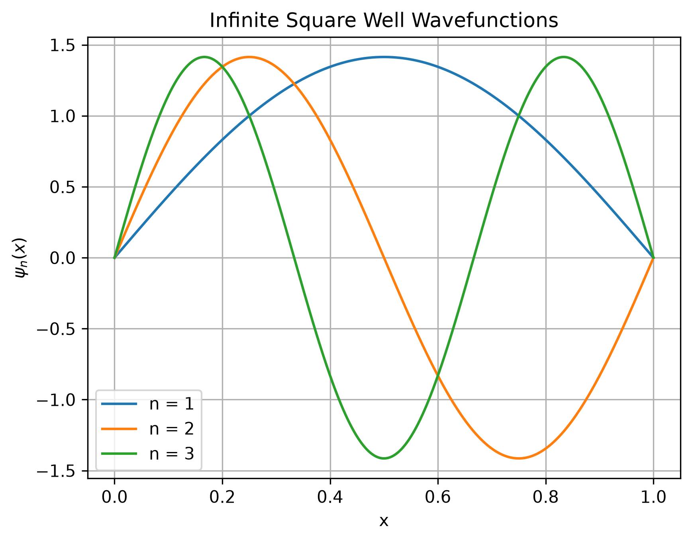

#### Probability Densities

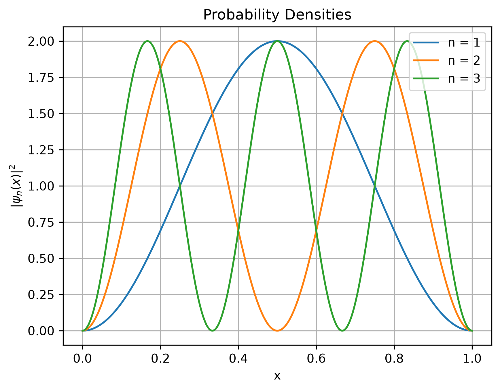

#### Energy Levels

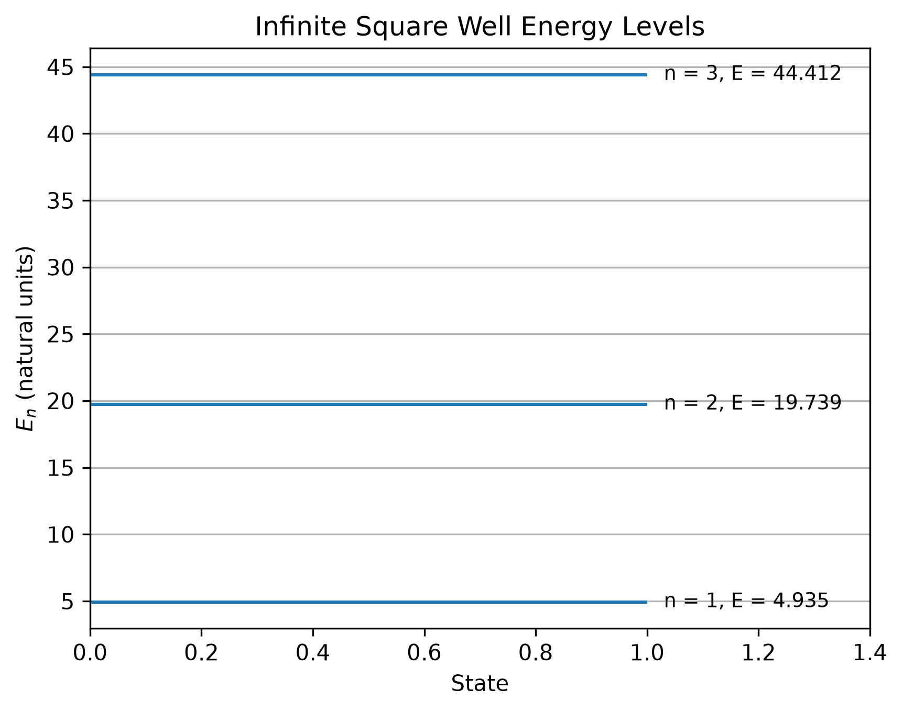

#### Infinite Square Well Validation

The finite-difference solver was validated by the infinite square well, which has analytical energies known exactly.
For a well extending from $x = 0$ to $x = L$, the analytical energy eigenvalues are

$$ 
E_n = \frac{n^2\pi^2\hbar^2}{2mL^2},
\qquad n = 1, 2, 3, \ldots
$$ 

The numerical Hamiltonian is constructed on the interior spatial grid, while the boundary conditions

$$
\psi(0) = \psi(L) = 0
$$

are imposed by excluding the two boundary points from the numerical calculation. The lowest numerical energy
eigenvalues are compared with their analytical values using the relative error

$$
\text{relative error} = \frac{|E_{\text{numerical}}-E_{\text{analytical}}|}
{E_{\text{analytical}}}.
$$

The numerical energies closely reproduce the analytical results, with small relative errors for the lowest energy
states. This validates the shared finite-difference Hamiltonian and Schrödinger-equation solver before they are
applied to systems without simple analytical solutions.

#### Relative Energy Errors

The numerical energy eigenvalues are compared with the analytical results

$$
E_n = \frac{n^2 \pi^2 \hbar^2}{2mL^2}.
$$

| State (n) | Numerical Energy | Analytical Energy | Relative Error |
|---:|---:|---:|---:|
| 1 | 4.934786 | 4.934802 | 3.303 × 10⁻⁶ |
| 2 | 19.738948 | 19.739209 | 1.321 × 10⁻⁵ |
| 3 | 44.411900 | 44.413220 | 2.973 × 10⁻⁵ |
| 4 | 78.953165 | 78.956835 | 4.648 × 10⁻⁵ |
| 5 | 123.359845 | 123.370055 | 8.275 × 10⁻⁵ |

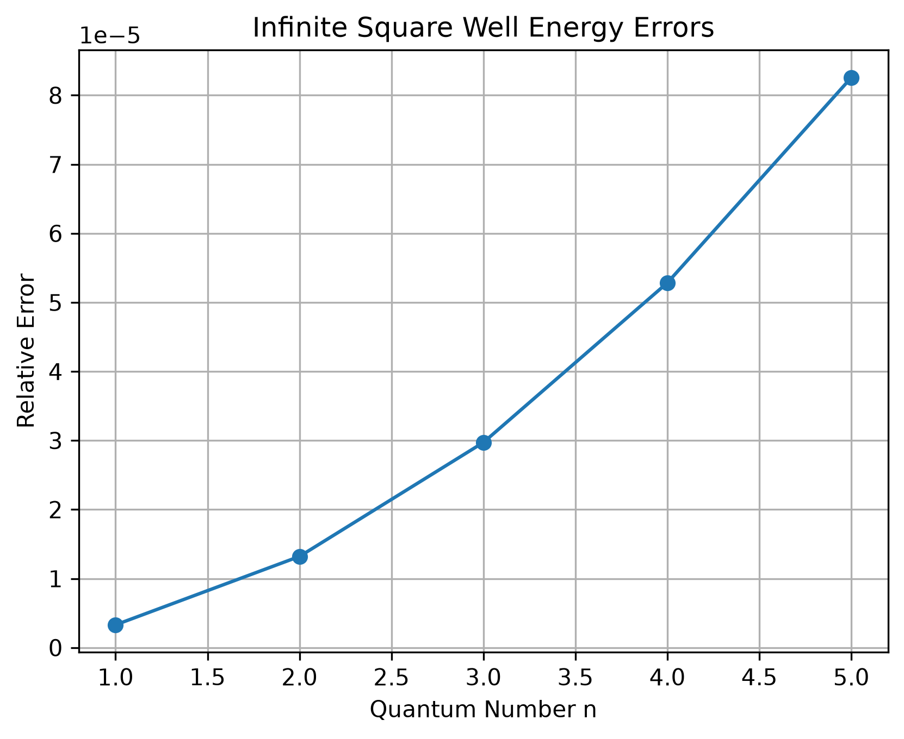

#### Wavefunction Comparison

The numerical wavefunctions obtained using the finite-difference method
are compared with the analytical eigenfunctions

$$
\psi_n(x) = \sqrt{\frac{2}{L}}\sin\left(\frac{n\pi x}{L}\right).
$$

The numerical and analytical wavefunctions agree closely for the first
three energy eigenstates. Since an eigenvector is defined only up to an
overall sign, the signs of the numerical wavefunctions are adjusted before
the comparison.

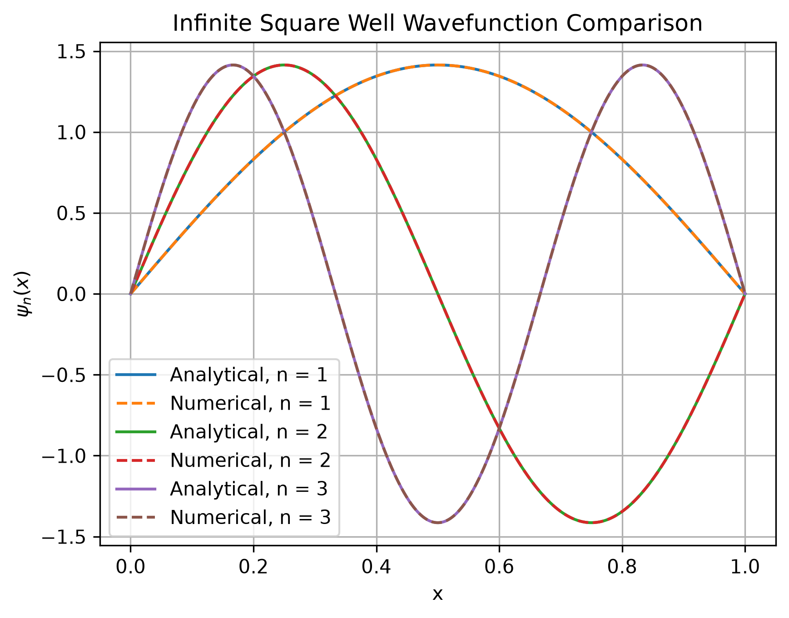

#### Numerical Convergence

The convergence of the finite-difference method was tested by calculating
the ground-state energy using increasingly fine spatial grids.

As the number of grid points increases, the relative error decreases,
showing that the numerical energy converges toward the analytical result.

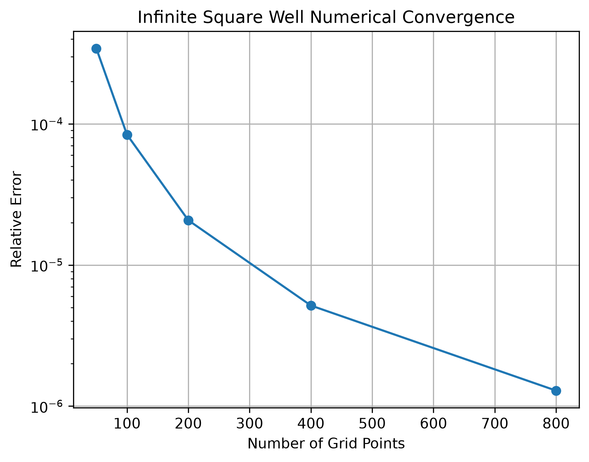

### Finite Square Well

The finite square well is solved numerically using the finite-difference method.

The continuous Hamiltonian operator

$$
\hat{H} = -\frac{\hbar^2}{2m}\frac{d^2}{dx^2} + V(x)
$$

is approximated by a symmetric tridiagonal matrix on a uniformly spaced spatial grid. Numerical diagonalization is then
used to obtain the energy eigenvalues and eigenfunctions.

Current calculations include:

- A finite square well potential with adjustable width and barrier height
- Construction of the finite-difference Hamiltonian matrix
- Numerical calculation of energy eigenvalues and eigenfunctions
- Identification of bound states with energies below the external barrier
- Bound-state wavefunctions obtained using the finite-difference method
- Numerical normalization of wavefunctions
- Visualization of the potential, energy levels, and shifted wavefunctions

#### Potential

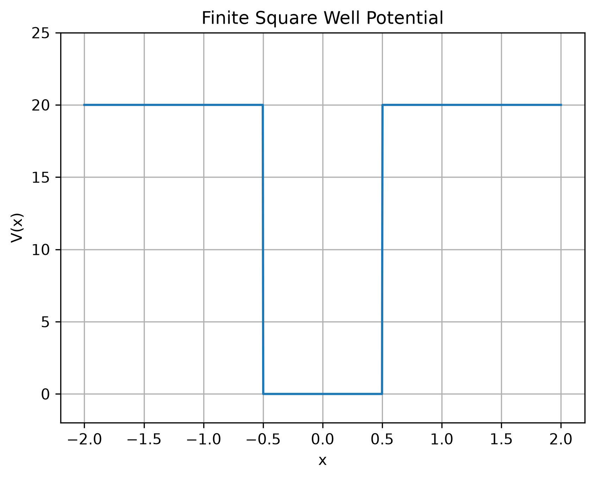

#### Bound-State Wavefunctions

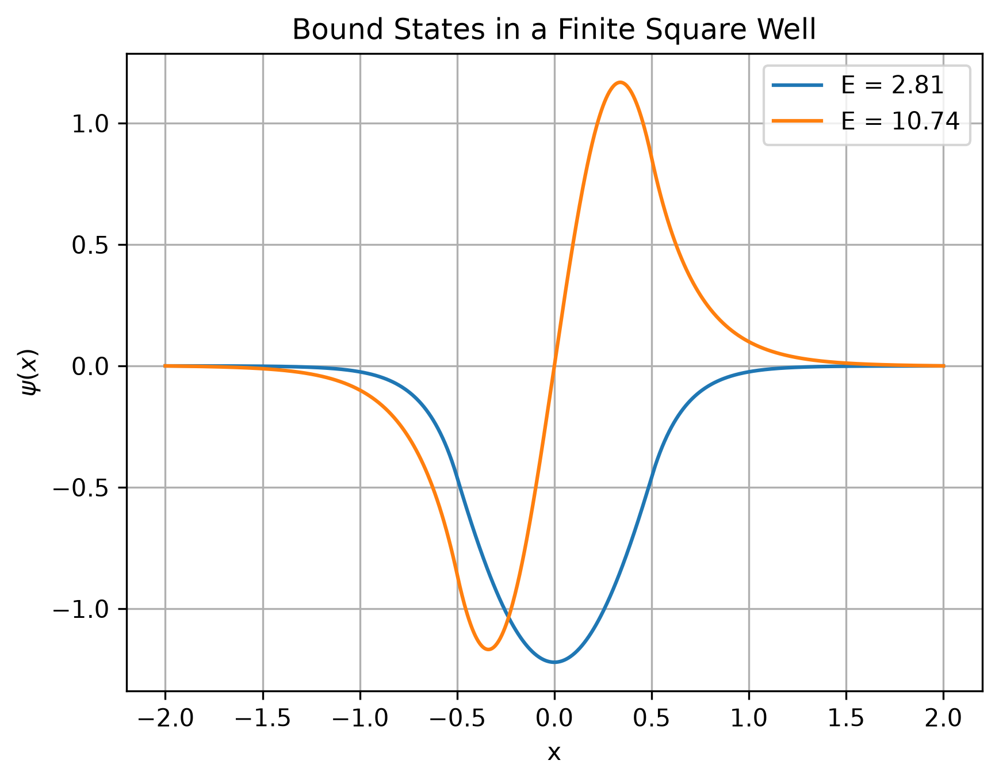

#### Wavefunction Decay Outside the Well

For a bound state with $E < V_0$, the wavefunction does not
vanish immediately at the boundaries of a finite square well.
Instead, it penetrates into the classically forbidden region and
decays exponentially.

Outside the well, the decay constant is

$$
\kappa =
\frac{\sqrt{2m(V_0-E)}}{\hbar},
$$

and the wavefunction behaves approximately as

$$
|\psi(x)| \propto e^{-\kappa |x|}.
$$

On a logarithmic vertical scale, exponential decay appears as a
straight line. The nearly linear tails in the figure therefore
confirm the expected exponential behavior outside the well.

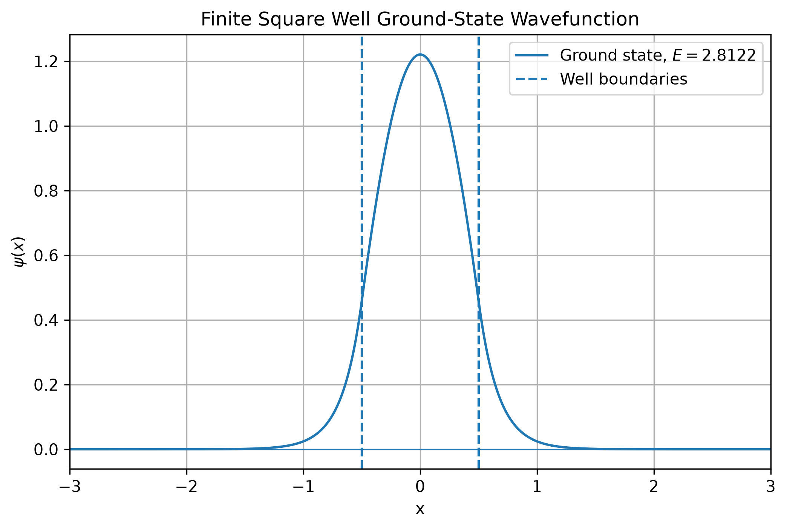

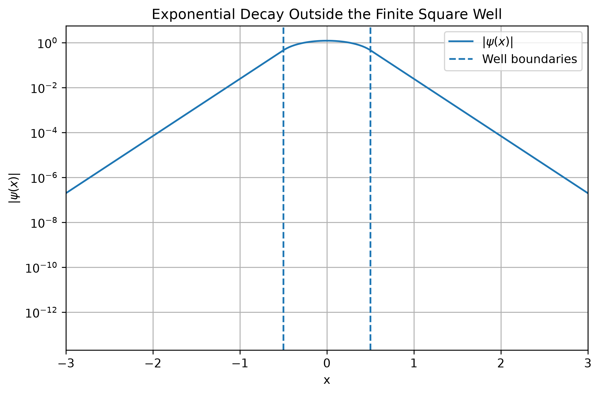

#### Bound-State Parity

Because the finite square well potential is symmetric about \(x=0\),

$$
V(-x)=V(x),
$$

its bound-state wavefunctions have definite parity. Numerical
wavefunctions were classified by comparing each state with its
spatially reflected form.

The ground state was found to have even parity,

$$
\psi(-x)=\psi(x),
$$

while the first excited state had odd parity,

$$
\psi(-x)=-\psi(x).
$$

This agrees with the expected alternating parity structure of
eigenstates in a symmetric one-dimensional potential.

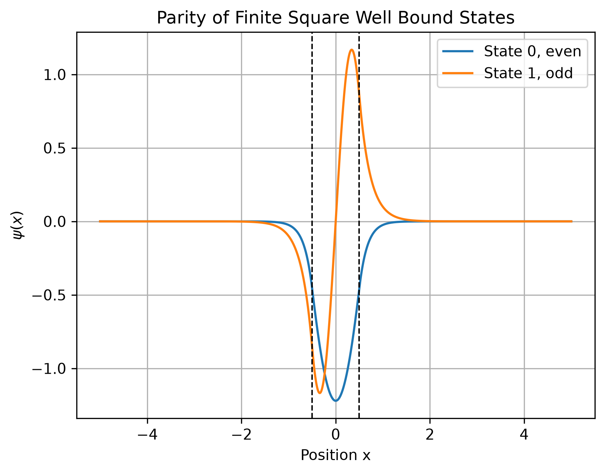

#### Bound States and Energy Levels

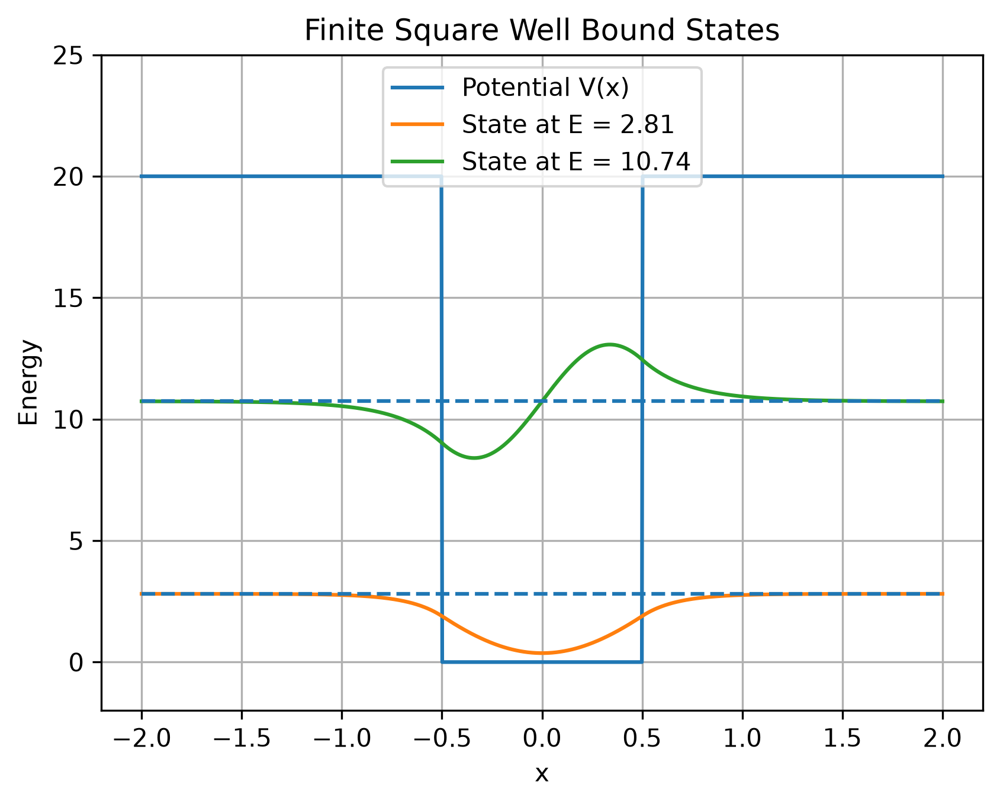

#### Numerical Convergence

A grid-convergence test was performed for the finite square well by increasing the number of spatial grid points.

The calculated bound-state energies approach stable values as the grid is refined.

For the selected well parameters:

- Ground-state energy: approximately $2.81$
- First excited-state energy: approximately $10.73$

Increasing the grid points from 400 to 800 changes both energies by approximately $0.2%$, indicating reasonable numerical
convergence.

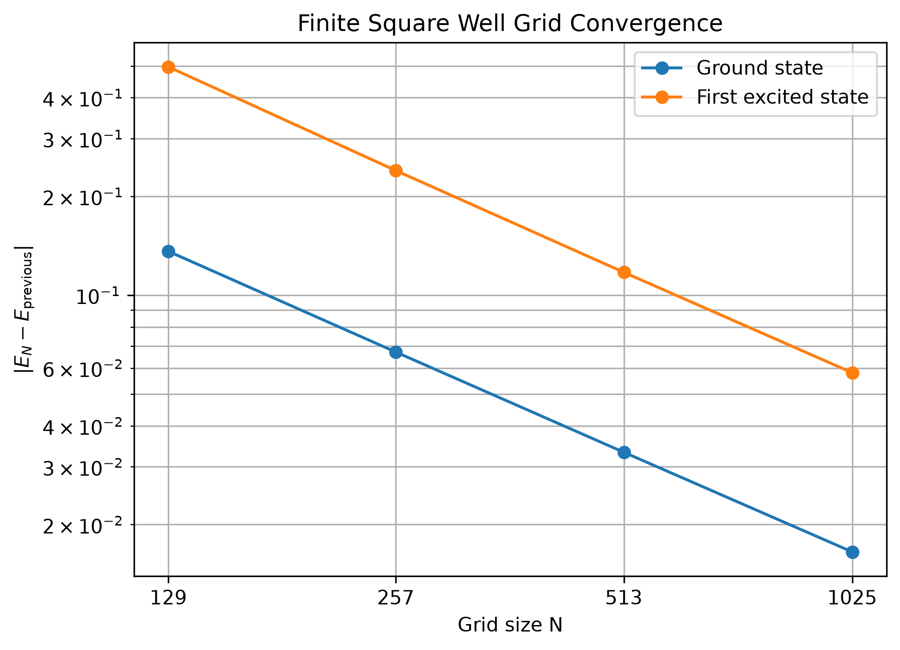

#### Effect of Well Depth

The barrier height $V_0$ was varied while the well width was kept fixed.

The number of numerical bound states increases as the well becomes deeper:

- $V_0 = 5$: 1 bound state
- $V_0 = 10$: 2 bound states
- $V_0 = 20$: 2 bound states
- $V_0 = 40$: 3 bound states
- $V_0 = 80$: 4 bound states

This demonstrates that deeper finite wells can support more bound states.

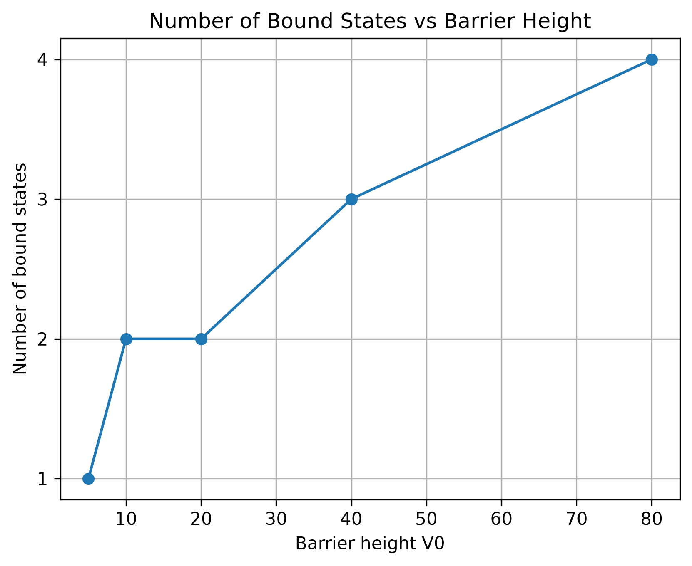

#### Effect of Well Width

The barrier height was fixed at $V_0 = 20$, while the well width was varied. Wider wells support more bound states
because the energy levels decrease as the width increases, allowing more states to lie below the barrier energy.

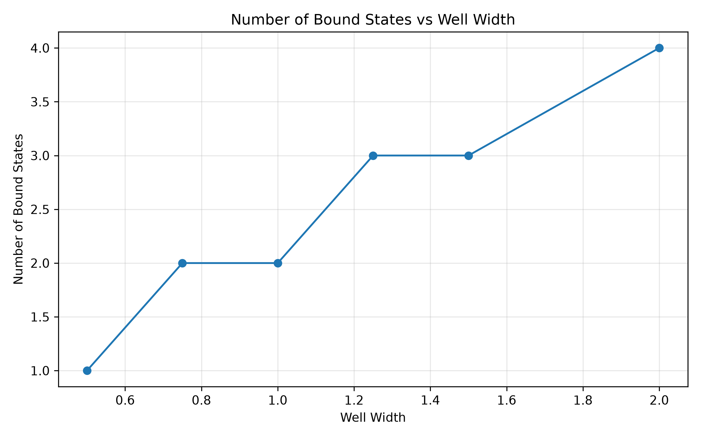

### Quantum Harmonic Oscillator

The one-dimensional quantum harmonic oscillator was studied numerically using
the finite-difference method.

The harmonic oscillator potential is

$$
V(x) = \frac{1}{2}m\omega^2x^2.
$$

The calculations use natural units with

$$
\hbar = m = \omega = 1.
$$

Under these units, the potential becomes

$$
V(x) = \frac{1}{2}x^2,
$$

and the analytical energy eigenvalues are

$$
E_n = \hbar\omega\left(n+\frac{1}{2}\right) = n+\frac{1}{2},
$$

where $n=0,1,2,\ldots$.

Current calculations include:

- Numerical solution of the one-dimensional Schrödinger equation
- Visualization of the harmonic oscillator potential
- Numerical energy eigenvalues for the first five states
- Comparison between numerical and analytical energy eigenvalues
- Visualization of energy levels and shifted wavefunctions
- Comparison between numerical and analytical wavefunctions
- Examination of wavefunction nodes and parity

#### Energy Eigenvalues

The numerical energy eigenvalues were compared with the exact analytical
values for the first five states.

| n | Numerical Energy | Analytical Energy | Relative Error |
|---:|---:|---:|---:|
| 0 | 0.49999549 | 0.50000000 | 9.02 × 10⁻⁶ |
| 1 | 1.49997745 | 1.50000000 | 1.50 × 10⁻⁵ |
| 2 | 2.49994138 | 2.50000000 | 2.34 × 10⁻⁵ |
| 3 | 3.49988727 | 3.50000000 | 3.22 × 10⁻⁵ |
| 4 | 4.49981512 | 4.50000000 | 4.11 × 10⁻⁵ |

The numerical energies agree closely with the analytical results, with
relative errors of approximately $10^{-5}$. The equally spaced energy levels
are also correctly reproduced:

$$
E_{n+1}-E_n=\hbar\omega.
$$

#### Potential, Energy Levels, and Wavefunctions

The harmonic oscillator potential, the first five numerical energy levels,
and the corresponding shifted wavefunctions are shown below.

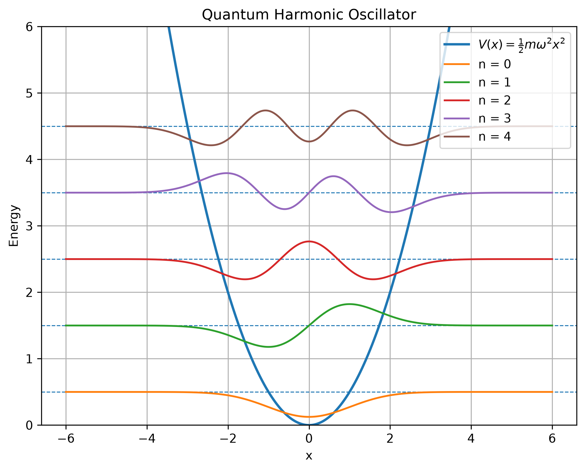

The potential is symmetric about $x=0$. The numerical wavefunctions display
the expected node structure: the state with quantum number $n$ contains
exactly $n$ nodes.

The states also alternate in parity:

- Even $n$ states have even parity
- Odd $n$ states have odd parity

#### Numerical and Analytical Wavefunction Comparison

The analytical harmonic oscillator wavefunctions are

$$
\psi_n(x)=\frac{1}{\sqrt{2^n n!}}\left(\frac{m\omega}{\pi\hbar}\right)^{1/4}H_n\left(\sqrt{\frac{m\omega}{\hbar}}x\right)
\exp\left(-\frac{m\omega x^2}{2\hbar}\right),
$$

where $H_n$ is the physicists' Hermite polynomial.

The numerical and analytical wavefunctions were compared for the first four
energy eigenstates.

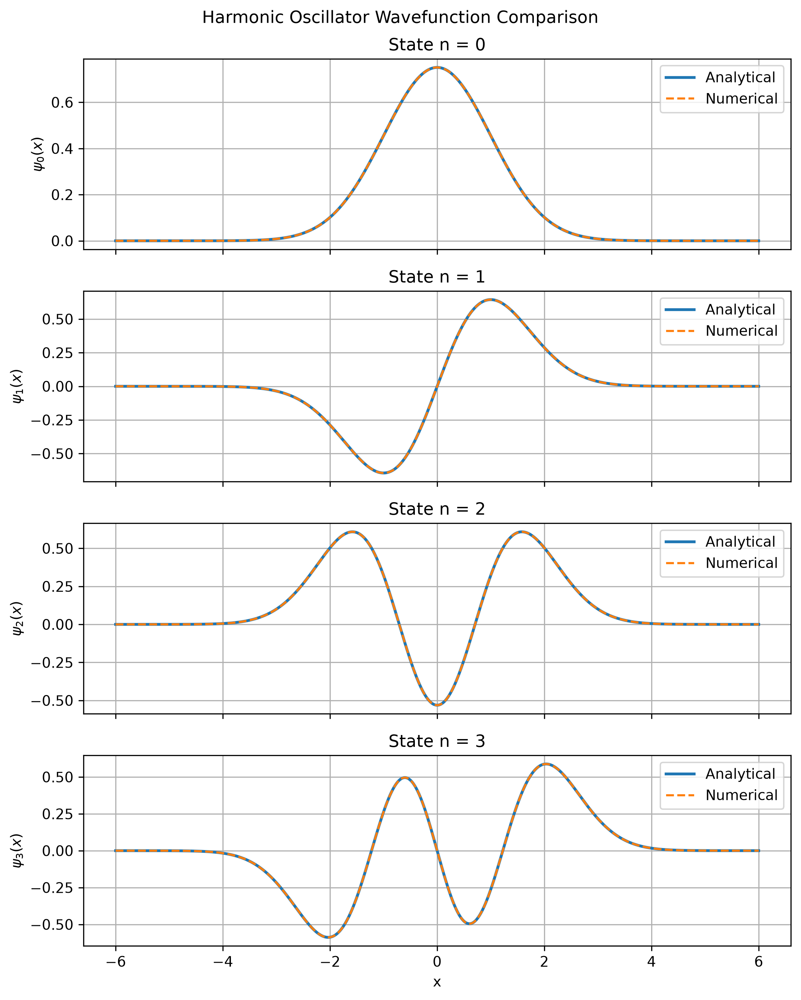

The numerical and analytical curves nearly overlap, showing that the
finite-difference solver accurately reproduces both the energies and shapes of
the harmonic oscillator eigenstates.

Because an eigenfunction and its negative represent the same physical state,
the overall signs of the numerical wavefunctions were adjusted when necessary
before plotting the comparison.

#### Grid Convergence

Grid convergence was tested on the fixed computational domain
$x\in[-8,8]$ by increasing the number of spatial grid points.

The relative errors of the first five energy eigenvalues decrease
systematically as the grid is refined. When the grid spacing is
approximately halved, the errors decrease by roughly a factor of four,
indicating second-order convergence. This is consistent with the
central finite-difference approximation used for the second derivative.

Higher-energy states have slightly larger errors because their
wavefunctions contain more rapid spatial oscillations and therefore
require finer resolution.

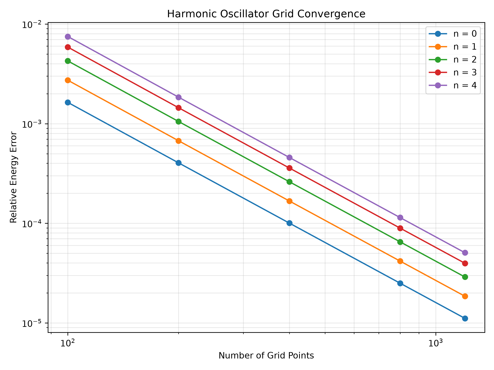

#### Domain Convergence

Domain convergence was tested by increasing the computational
half-width while keeping the grid spacing fixed at approximately
$\Delta x=0.02$.

Small computational domains produce substantial boundary-truncation
errors because the harmonic oscillator wavefunctions have not fully
decayed at the artificial boundaries. These effects are more pronounced
for higher-energy states, whose wavefunctions extend farther from the
origin.

For domain half-widths of approximately $5$ or larger, the numerical
energies become stable. The relative errors then approach a constant
plateau, indicating that the domain error has become negligible and
that the remaining error is dominated by the fixed grid spacing.

Some individual errors are not strictly monotonic because the domain
truncation error and finite-difference error may partially cancel for
particular domain sizes.

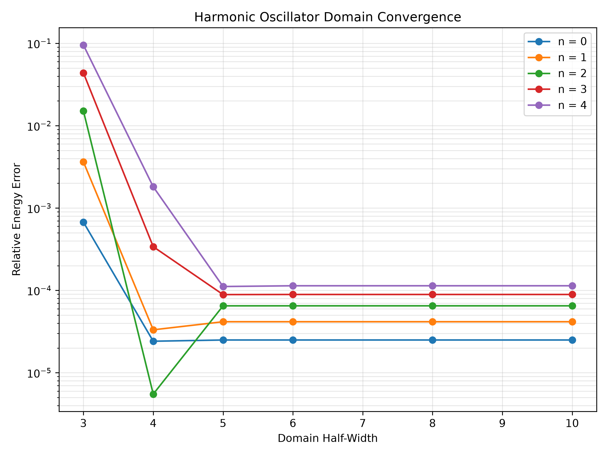

### Quantum Tunneling

Quantum tunneling through a rectangular potential barrier is studied using the analytical transmission coefficient.

The potential is defined as

$$
V(x) = \begin{cases} 0, & x < 0, \\ V_0, & 0 \leq x \leq a, \\ 0, & x > a, \end{cases}
$$

where $V_0$ is the barrier height and $a$ is the barrier width.

For particle energies below the barrier height, $E < V_0$, the transmission probability is

$$
T = \left[1 + \frac{V_0^2 \sinh^2(\kappa a)} {4E(V_0-E)} \right]^{-1},
$$

where

$$
\kappa = \frac{\sqrt{2m(V_0-E)}}{\hbar}.
$$

Although a classical particle cannot cross the barrier when $E < V_0$, the quantum-mechanical transmission probability
remains nonzero.

For particle energies above the barrier height, $E > V_0$, the transmission probability is

$$
T = \left[1 + \frac{V_0^2 \sin^2(qa)} {4E(E-V_0)} \right]^{-1},
$$

where

$$
q =
\frac{\sqrt{2m(E-V_0)}}{\hbar}.
$$

The transmission probability was calculated over a range of particle energies using natural units with

$$
\hbar = m = 1.
$$

The calculation shows:

- Nonzero transmission for $E < V_0$, demonstrating quantum tunneling
- Increasing transmission as the particle energy approaches the barrier height
- Partial reflection even when $E > V_0$
- Resonant transmission at specific energies where $T = 1$

#### Transmission Probability

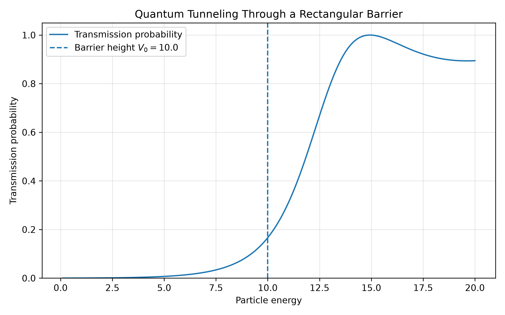

## Numerical Methods

The numerical calculations use a central finite-difference approximation for the second derivative:

$$
\frac{d^2\psi}{dx^2}
\approx
\frac{\psi_{i+1}-2\psi_i+\psi_{i-1}}
{\Delta x^2}
$$

This produces a Hamiltonian matrix with:

- Kinetic energy and potential energy terms on the main diagonal
- Finite-difference coupling terms on the first upper and lower diagonals

Because the Hamiltonian matrix is real and symmetric, its eigenvalues and eigenvectors are calculated using
`numpy.linalg.eigh`.

The numerical eigenfunctions are normalized according to

$$
\int |\psi(x)|^2\,dx = 1
$$

## Shared Numerical Utilities

Reusable numerical functions are stored in `quantum_utils.py`.

These utilities include:

- Validation of one-dimensional spatial grids
- Construction of finite-difference Hamiltonian matrices
- Numerical solution of the time-independent Schrödinger equation
- Numerical normalization of eigenfunctions
- Identification of bound states below a specified energy threshold

Using shared utility functions reduces duplicated code and keeps the individual simulation scripts focused on the
physical systems being studied.

## Features

- Computes analytical eigenfunctions and energies for the infinite square well
- Calculates probability densities for analytical wavefunctions
- Solves the infinite square well numerically using the finite-difference method
- Validates the solver by comparing numerical solutions with analytical solutions
- Calculates relative errors between numerical and analytical energies
- Constructs finite-difference Hamiltonian matrices for the finite square well
- Solves the time-independent Schrödinger equation numerically
- Calculates bound-state energies and wavefunctions
- Normalizes numerical wavefunctions using numerical integration
- Identifies bound states using an energy threshold
- Plots potentials, wavefunctions, probability densities, and energy levels
- Performs a grid-convergence test for the numerical calculation
- Investigates how well depth affects the number of bound states
- Uses reusable numerical functions through a shared utility module

## Tools

- Python
- NumPy
- Matplotlib

## Units

For simplification, calculations use natural units where appropriate:

- $\hbar = 1$
- $m = 1$
- $L = 1$ for the infinite square well

## Project Structure

```text
one_dimensional_quantum_systems/
├── figures/
│   ├── bound_states_vs_depth.png
│   ├── bound_states_vs_width.png
│   ├── finite_well_bound_states.png
│   ├── finite_well_convergence.png
│   ├── finite_well_parity.png
│   ├── finite_well_potential.png
│   ├── finite_well_wavefunction_decay.png
│   ├── finite_well_wavefunction_decay_log.png
│   ├── finite_well_wavefunctions.png
│   ├── harmonic_oscillator.png
│   ├── ho_domain_convergence.png
│   ├── ho_grid_convergence.png
│   ├── ho_wavefunction_comparison.png
│   ├── infinite_well_convergence.png
│   ├── infinite_well_energy_errors.png
│   ├── infinite_well_energy_levels.png
│   ├── infinite_well_probability_density.png
│   ├── infinite_wavefunction_comparison.png
│   ├── infinite_well_wavefunctions.png
│   ├── tunneling_transmission_vs_energy.png
│   ├── tunneling_width_log_study.png
│   └── tunneling_width_study.png
├── finite_square_well.py
├── finite_well_convergence.py
├── finite_well_depth_study.py
├── finite_well_parity.py
├── finite_well_wavefunction.py
├── finite_well_width_study.py
├── harmonic_oscillator.py
├── ho_domain_convergence.py
├── ho_grid_convergence.py
├── ho_wavefunction_comparison.py
├── infinite_square_well.py
├── infinite_well_convergence.py
├── infinite_well_validation.py
├── infinite_well_wavefunction_comparison.py
├── quantum_tunneling.py
├── quantum_utils.py
├── .gitignore
├── README.md
└── tunneling_width_study.py
```

## Status

This project is currently under development.